# TagGate Prototype Diagrams

This document uses Mermaid diagrams. GitHub renders these diagrams directly in Markdown.

## Prototype Scope

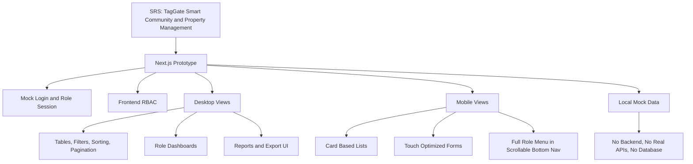

## Role Use Case Diagram

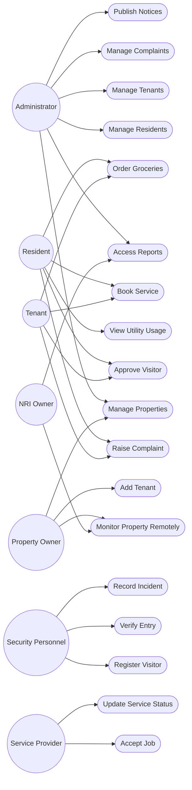

## Navigation and RBAC Flow

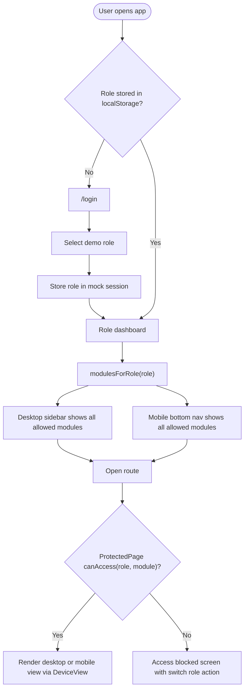

## Application Architecture

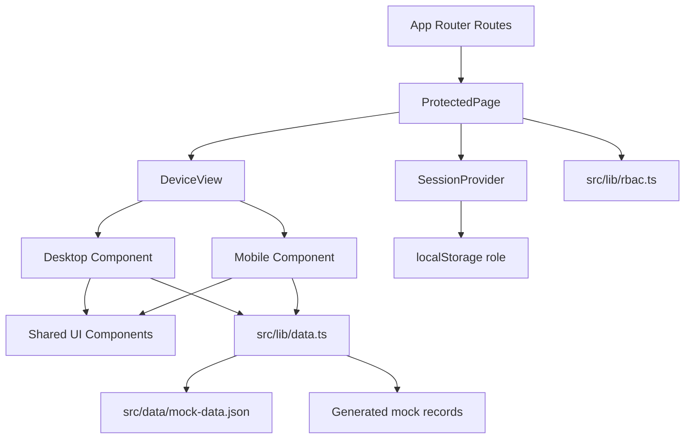

## Login Sequence

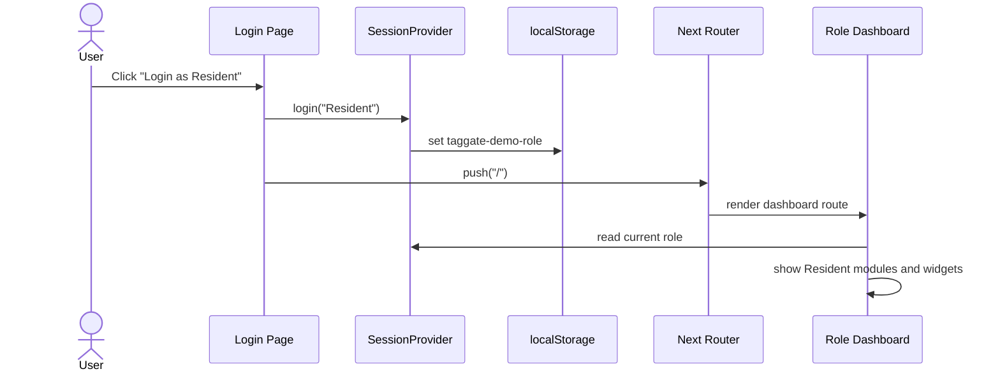

## Protected Route Sequence

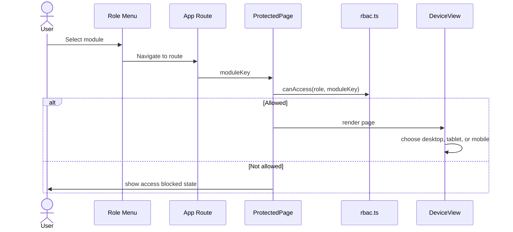

## Role Dashboard Activity

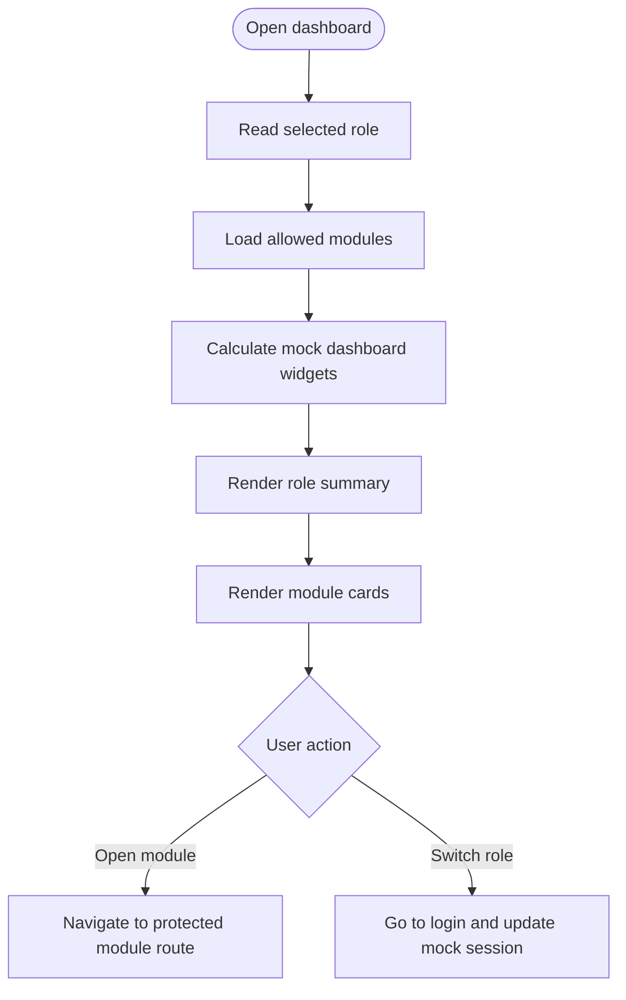

## Generic Module CRUD Activity

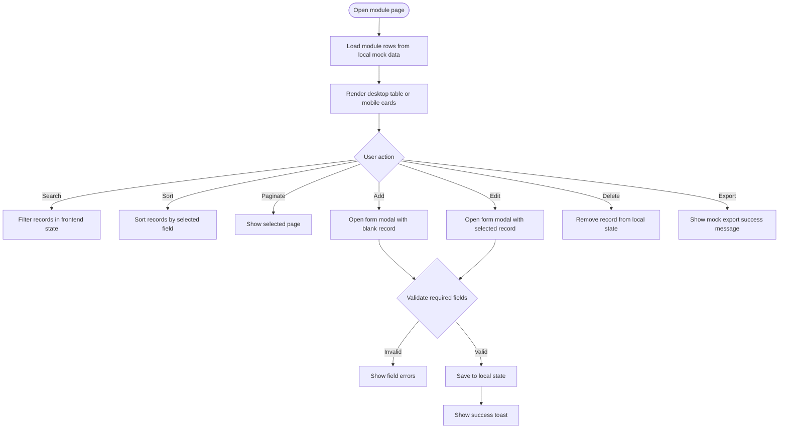

## Complaint Workflow Sequence

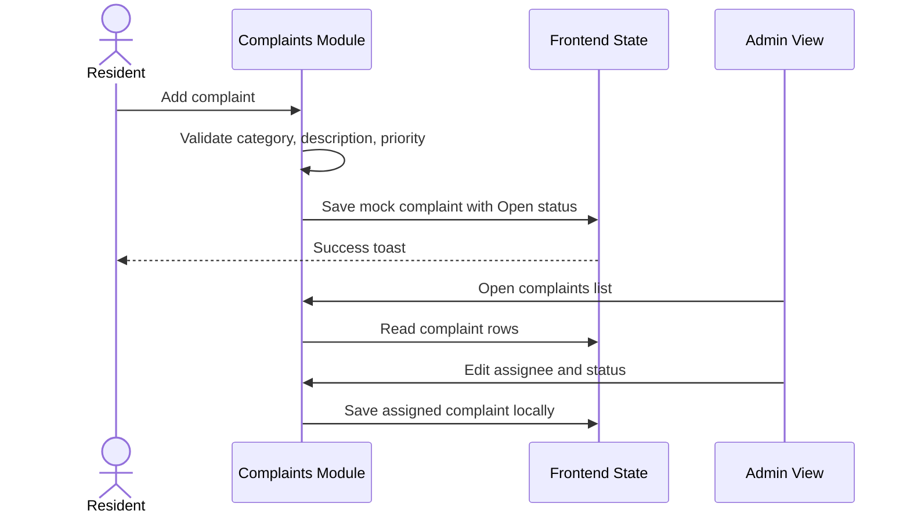

## Visitor Security Workflow

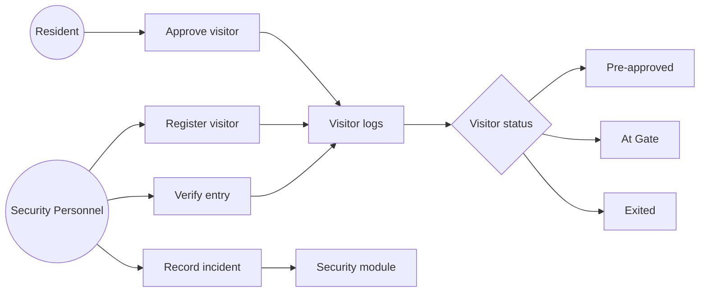

## Service Provider Workflow

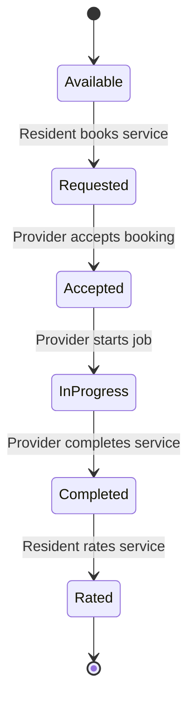

## Grocery Marketplace Activity

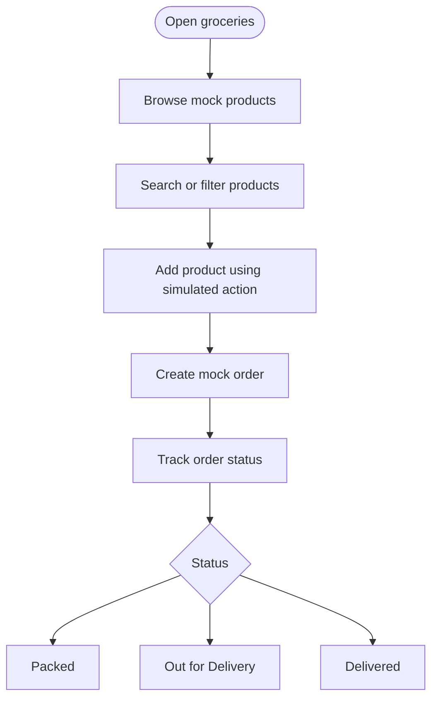

## Amenity Booking Sequence

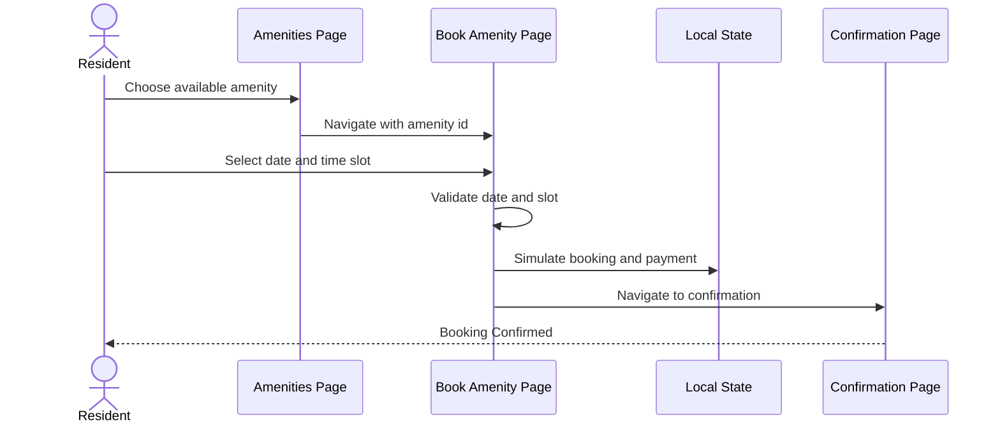

## Community Event Registration Sequence

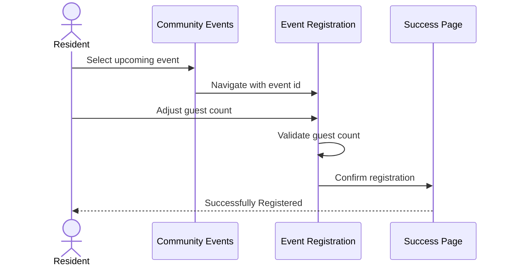

## Conversational Assistant Activity

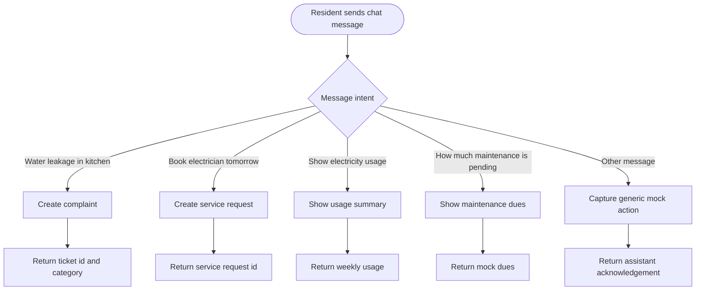

## Reports Flow

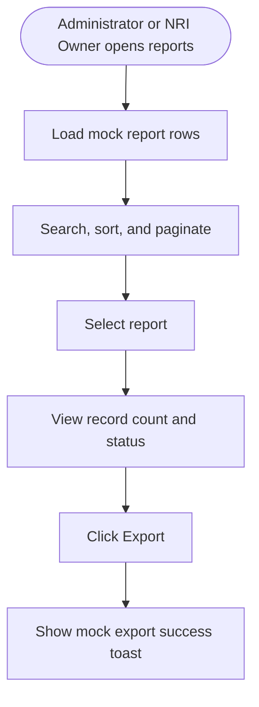

## Data Model Overview

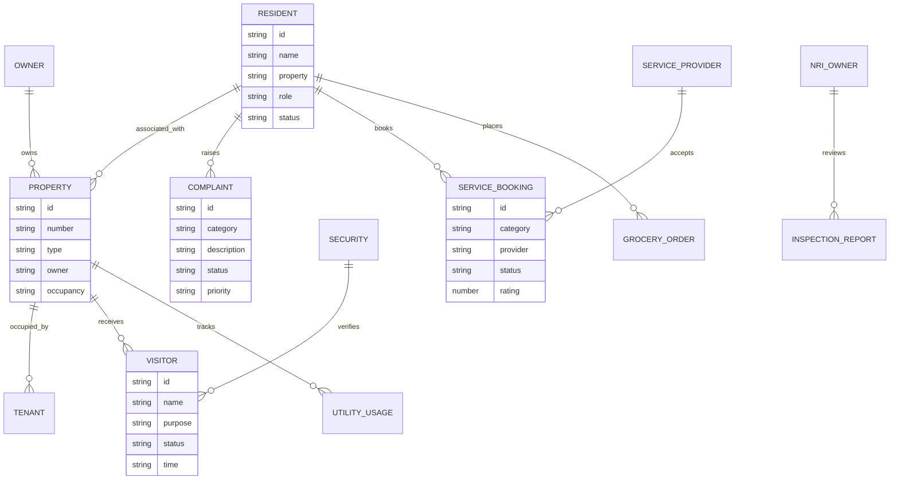

## Desktop vs Mobile Rendering

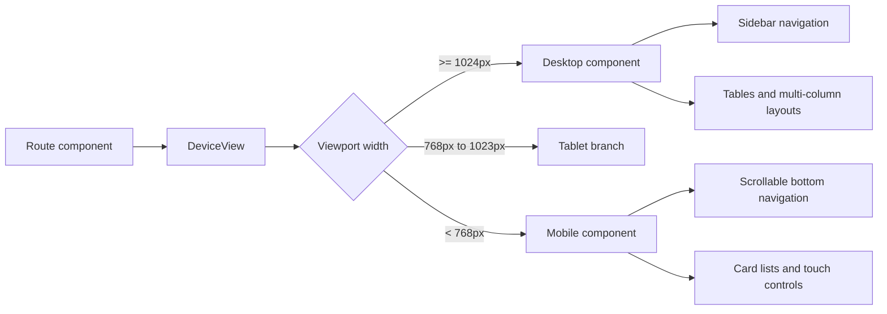

## Current Route Map

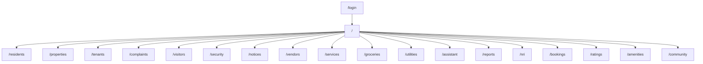
